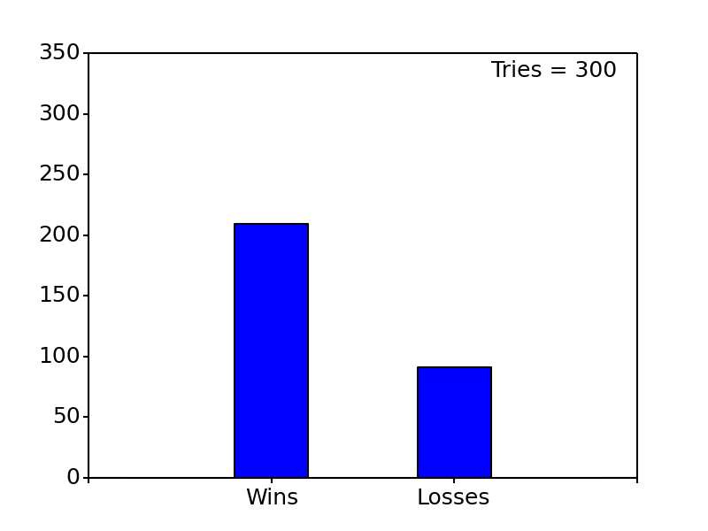

# Monty Hall Problem Simulation
by Matt Stetz 2018

## Introduction
The monty hall problem is a famous probability brain teaser that was controversial when it was first presented a few decades ago. It is based on a game show where a contestant would be shown three doors. Behind two of the doors are goats and behind the last remaining door is a car. The contestant is asked to pick a door. Then the contestant is shown one of the two goats. 

* The brain teaser is: Is it more advantageous to switch your original choice after being shown the first goat or to hold? 

* Does it make a difference?

## Description
This scrip will allow you to play the game as many times as you want. You have three options:
* Switch your first choice every single time
* Stick with your first choice every single time
* Random

## Execution
Set the flags at the top of the script then run

## Example Output
Example plots for different outputs can be found in the "Results" folder

* Below is an example plot for 300 plays where the playe always switches after being shown the goat

